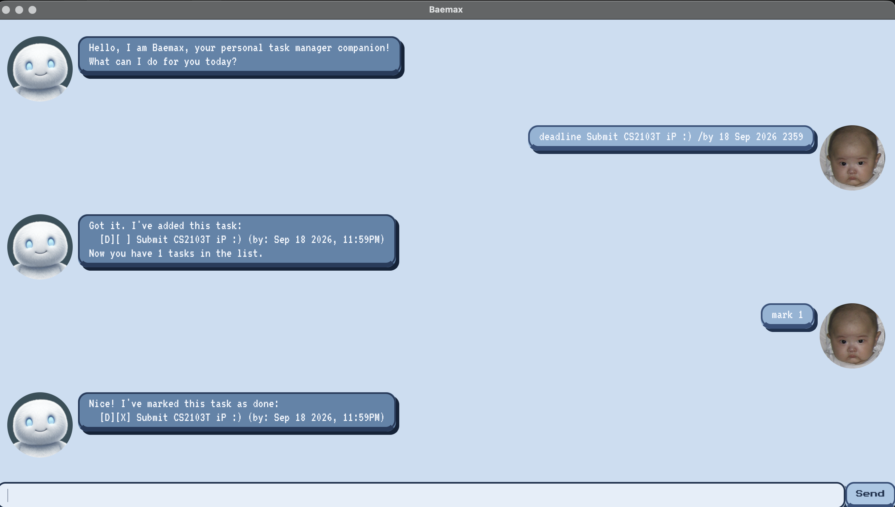

# Baemax User Guide



Baemax is a desktop chatbot for tracking your to-dos, deadlines, and events.
It's optimised for **typing** — if you can type fast, Baemax can manage your
tasks faster than any point-and-click app.

## Quick start

1. Make sure you have **Java 17 or above** installed.
2. Download the latest `baemax.jar` from the
   [releases page](https://github.com/cjldylan/ip/releases).
3. Open a terminal in the folder containing the jar and run:

   ```
   java -jar baemax.jar
   ```

4. Type a command into the input box at the bottom and press Enter or click
   **Send**. Try `help` first to see everything Baemax can do.

## Features

> **Notes on the command format**
> - Words in `<angle brackets>` are parameters you supply, e.g. in
>   `todo <description>`, `description` is a parameter that could be used as
>   `todo read book`.
> - Dates can be written as `2026-09-20`, `20/9/2026`, `20-9-2026`,
>   `20 Sep 2026`, or `Sep 20 2026`, and can optionally be followed by a time
>   such as `1800`, `18:00`, `6pm`, or `6:30pm`.
> - Task numbers refer to a task's position in the most recently displayed
>   list (from `list` or `find`), counting from 1.

### Adding a todo: `todo`

Adds a task with just a description, and no date attached.

Example: `todo read book`

```
Got it. I've added this task:
  [T][ ] read book
Now you have 1 tasks in the list.
```

### Adding a deadline: `deadline`

Adds a task that needs to be done by a specific date and, optionally, time.

Example: `deadline Submit CS2103T iP /by 2026-09-18 2359`

```
Got it. I've added this task:
  [D][ ] Submit CS2103T iP (by: Sep 18 2026, 11:59PM)
Now you have 1 tasks in the list.
```

### Adding an event: `event`

Adds a task that spans a start and an end date/time.

Example: `event orientation camp /from 20 Sep 2026 0900 /to 22 Sep 2026 1800`

```
Got it. I've added this task:
  [E][ ] orientation camp (from: Sep 20 2026, 9:00AM to: Sep 22 2026, 6:00PM)
Now you have 1 tasks in the list.
```

### Listing all tasks: `list`

Shows every task currently being tracked, numbered from 1.

Example: `list`

```
Here are the tasks in your list:
1. [T][ ] read book
2. [D][ ] Submit CS2103T iP (by: Sep 18 2026, 11:59PM)
```

### Finding tasks: `find`

Shows only the tasks whose description contains the given keyword
(case-insensitive).

Example: `find book`

```
Here are the matching tasks in your list:
1. [T][ ] read book
```

### Marking a task as done: `mark`

Marks the task at the given number as completed.

Example: `mark 1`

```
Nice! I've marked this task as done:
  [T][X] read book
Great job looking after yourself!
```

### Marking a task as not done: `unmark`

Marks the task at the given number as not yet completed.

Example: `unmark 1`

```
OK, I've marked this task as not done yet:
  [T][ ] read book
No worries, take your time.
```

### Deleting a task: `delete`

Removes the task at the given number from the list.

Example: `delete 1`

```
Noted. I've removed this task:
  [T][ ] read book
Now you have 0 tasks in the list.
```

### Undoing the last change: `undo`

Reverts the most recent `todo`, `deadline`, `event`, `mark`, `unmark`, or
`delete` — one level of undo, going back a single step. A command that
failed (e.g. an out-of-range task number) is never counted as the "last
change".

Example: `undo`

```
Undone! Here are the tasks in your list now:
1. [T][ ] read book
```

### Viewing help: `help`

Lists every command Baemax understands, with its format.

Example: `help`

### Exiting the program: `bye`

Says goodbye and closes Baemax.

Example: `bye`

## Saving the data

Baemax automatically saves your tasks to disk after every command that
changes the list. There's no need to save manually, and your tasks will
still be there the next time you start Baemax.

## Command summary

| Action | Format | Example |
|---|---|---|
| Todo | `todo <description>` | `todo read book` |
| Deadline | `deadline <description> /by <date> [time]` | `deadline Submit iP /by 2026-09-18 2359` |
| Event | `event <description> /from <date> [time] /to <date> [time]` | `event camp /from 20 Sep 2026 /to 22 Sep 2026` |
| List | `list` | `list` |
| Find | `find <keyword>` | `find book` |
| Mark | `mark <task number>` | `mark 1` |
| Unmark | `unmark <task number>` | `unmark 1` |
| Delete | `delete <task number>` | `delete 1` |
| Undo | `undo` | `undo` |
| Help | `help` | `help` |
| Exit | `bye` | `bye` |
